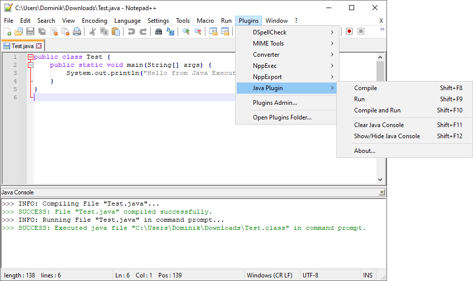

# Introduction

## What is NppJavaPlugin?

NppJavaPlugin is a Java Plugin for Notepad++, which allows you to compile and run Java code directly from Notepad++.

## Why would I want to use NppJavaPlugin?

NppJavaPlugin was created with following use cases in mind:
* Simple Code Experiments
* Simple Code Creation for Education Purposes
* Preparing for a Coding Interview (Amazon, Facebook, Google, Netflix, …)
* Preparing for a Java Certification
   * Oracle Certified Professional: Java SE 21 Developer Professional (1Z0-830)
   * Oracle Certified Professional: Java SE 17 Developer (1Z0-829)
   * Oracle Certified Professional: Java SE 11 Developer (1Z0-819)
   * Oracle Certified Associate Java SE 8 Programmer (1Z0-808)
   * Oracle Certified Professional Java SE 8 Programmer (1Z0-809)

Whenever preparing for a Coding Interview or a Java Certification, you should create a practice environment that does **not** provide you with Integrated Development Environment (IDE) features like Code Completion, Syntax Highlight, Code Generation, Early Error Checking. During regular development IDE does a very good job of making developers more productive through those features, however during a Coding Interview or a Java Certification Exam, an environment under which you will take the exam, will not include those features. This is why it is important to practice without those features to make sure that you can write code accurately and fluently without having to rely on mentioned IDE features.

In other cases I recommend using a full IDE like IntelliJ, Eclipse, NetBeans.

## What functionalities are provided by NppJavaPlugin?

After installing NppJavaPlugin following options will be available under Plugins -> Java Plugin menu:
* Compile
* Run
* Compile and Run

On top of it, NppJavaPlugin also includes Java Console which will output compilation issues if those are found. Java Console can be manually shown with usage of “Show/Hide Java Console” option.

## Does NppJavaPlugin include any default keyboard shortcuts?

Yes, by default following keyboard shortcuts are configured:
* Compile - Shift + F8
* Run - Shift + F9
* Compile and Run - Shift + F10
* Clear Java Console - Shift + F11
* Show/Hide Java Console - Shift + F12

Those can be changed using Settings -> Shortcut Mapper -> Plugin commands option. If you need more information, more precise instructions can be found here: [https://npp-user-manual.org/docs/preferences/#shortcut-mapper](https://npp-user-manual.org/docs/preferences/#shortcut-mapper)

# Installation

## Prerequisites

* Java Development Kit (JDK) is installed
   * Plugin should work with any version
   * Plugin should work with any Java distribution
   * Here are some links on where you can download JDK:
      * [https://adoptium.net/](https://adoptium.net/)
      * [https://www.oracle.com/java/technologies/downloads/](https://www.oracle.com/java/technologies/downloads/)
* JAVA_HOME system property is set
   * [https://www.baeldung.com/java-home-on-windows-7-8-10-mac-os-x-linux#windows](https://www.baeldung.com/java-home-on-windows-7-8-10-mac-os-x-linux#windows)

## Automatic

1. Go to Plugins -> Plugins Admin
2. Search for "Java Plugin"
3. Check "Java Plugin"
4. Click Install

If you need more information, more precise instructions can be found here: [https://npp-user-manual.org/docs/plugins/#install-using-plugins-admin](https://npp-user-manual.org/docs/plugins/#install-using-plugins-admin)

## Manual

1. Download ZIP file from [https://github.com/dominikcebula/npp-java-plugin/releases](https://github.com/dominikcebula/npp-java-plugin/releases)
2. Unpack ZIP file to your Notepad++ installation folder, for example “C:\Program Files\Notepad++\plugins\NppJavaPlugin”

If you need more information, more precise instructions can be found here: [https://npp-user-manual.org/docs/plugins/#install-plugin-manually](https://npp-user-manual.org/docs/plugins/#install-plugin-manually)

# Ideas for future versions

* Tech:
   * Automated Test Coverage and Full CI - Unit and Integration Tests (Testing Pyramid)
   * Automated Code Quality Scans
   * Automated Security Scans (SAST)
   * Support for ARM64
* Features:
   * Compilation Feedback - after compilation is executed, if errors are detected, lines that contains issues are marked as red
   * Run Dialog - user can set program arguments for program execution
   * Run Dialog - user can set input for stdin from file
   * Run Dialog - user can redirect stdout and/or stderr to file
   * JDK autodetection - if JAVA_HOME is not set, plugin should automatically detect and find JDK
   * Clean Action - plugin deletes all created “.class” files when user clicks “Clean” option from menu
   * Configuration Dialog - user can define JDK that should be used, without plugin having to rely on JAVA_HOME system variable or autodetection
   * Configuration Dialog - user can set flags for code compilation
   * Configuration Dialog - user can set additional classpath elements for compilation and execution
   * Run Dialog - user can set environment variables for program execution
   * Java Console - ability to configure font, font size, colors for info, warnings, errors
   * Configuration Dialog - user can decide if application should execute in a separate command prompt or if it should execute under Plugin Java Console

# Contribution

## Inroduction

Get familiar with [Notepad++ User Manual - Plugins](https://npp-user-manual.org/docs/plugins/).

## Rules

You are more than welcome to contribute, but please keep in mind few rules:

* Use Modern C++ (C++11, C++17, …)
* Use Clean Code
* Use SOLID
* Use GoF Design Patterns (when applicable)
* Use KISS, DRY, YAGNI
* Use Component Coupling and Cohesion Principles (REP, CRP, CCP, ADP, SDP, SAP)
* Don't overdesign

## Building the project

* Clone the repository
* Install [Visual Studio 2022](https://visualstudio.microsoft.com/thank-you-downloading-visual-studio/?sku=Community&channel=Release&version=VS2022&source=VSLandingPage&passive=false&cid=2030)
    * Install `Desktop Development with C++` components
    * During the installation make sure to also select:
        * `MSVC v141 - VS 2017 C++ x64/x86 build tools`
        * `C++ CMake tools for Windows`
        * `MSBuild`
* Install [Windows 10 SDK, version 1809 (10.0.17763.0)](https://go.microsoft.com/fwlink/p/?LinkID=2033908)
* Open the `sln` file in Visual Studio.
* Click `Build` -> `Rebuild Solution`.

## Running plugin with local changes

* Download Notepad++ Portable Installation compatible with Notepad++ debug mode binary
    * At the time of writing this README.md file, Notepad++ debug mode binary is in version `7.8.1`
    * You can download compatible version under [npp.7.8.1.bin.x64.zip](https://github.com/notepad-plus-plus/notepad-plus-plus/releases/download/v7.8.1/npp.7.8.1.bin.x64.zip)
    * Extract zip file and place content of it under folder that will be referenced in this document as `<NPP_INST_DIR>`
* Download [Notepad++ debug mode binary](https://notepad-plus-plus.org/assets/pluginListTestTools/npp.debug.x64.zip)
* Replace `notepad++.exe` in your Notepad++ installation directory with downloaded `notepad++.exe`
* Download [WinGUP](https://notepad-plus-plus.org/assets/pluginListTestTools/wingup.release.x64.zip)
* Replace `GUP.exe` located in `updater` folder of your Notepad++ installation directory with downloaded `GUP.exe`
* Download Plugin list from [pl.x64.json](https://github.com/notepad-plus-plus/nppPluginList/blob/master/src/pl.x64.json) and place it under `<NPP_INST_DIR>\plugins\Config\nppPluginList.json`
* Create folder `<NPP_INST_DIR>\plugins\NppJavaPlugin`
* Inside the folder `<NPP_INST_DIR>\plugins\NppJavaPlugin` create a symlink named `NppJavaPlugin.dll` pointing to the `NppJavaPlugin.dll` of the project build output directory `vs.proj\x64\Debug\NppJavaPlugin.dll`
    * Example: `mklink NppJavaPlugin.dll <NPP_PLUGIN_CHECKOUT_DIR>\npp-java-plugin\vs.proj\x64\Debug\NppJavaPlugin.dll`
* To run the plugin under debug mode using Notepad++ debug mode binary you will need to change run configuration settings. Go to project properties, `Configuration Properties` -> `Debugging` and change `Command` to `<NPP_INST_DIR>\notepad++.exe`
* You will be able to now run the plugin `Debug -> Start Debugging (F5)` command.

Please also see [Test your plugins locally](https://npp-user-manual.org/docs/plugins/#test-your-plugins-locally) under Notepad++ User Manual - Plugins.

## Releasing new plugin version

* New version needs to be set under:
    * `NppPluginMain.rc` in `VS_VERSION_INFO`
    * [appveyor.yml](appveyor.yml) in `version`
* Create and push new Git Tag
* GitHub Release will be created automatically - [AppVeyor](appveyor.yml) is configured to release new version under [GitHub Releases](https://github.com/dominikcebula/npp-java-plugin/releases) after pushing new Git Tag
* Calculate SHA-256 for newly released zip archives (will be required to update plugin list in [nppPluginList](https://github.com/notepad-plus-plus/nppPluginList)
* Fork [nppPluginList](https://github.com/notepad-plus-plus/nppPluginList)
* Update npp-java-plugin in [nppPluginList](https://github.com/notepad-plus-plus/nppPluginList)
    * Under [pl.x64.json](https://github.com/notepad-plus-plus/nppPluginList/blob/master/src/pl.x64.json#L540)
	* Under [pl.x86.json](https://github.com/notepad-plus-plus/nppPluginList/blob/master/src/pl.x86.json#L581)
* Create PR for forked repo
* Wait for to get merged

More infomration available under [Rules for adding your plugins into list](https://npp-user-manual.org/docs/plugins/#rules-for-adding-your-plugins-into-list) and [Do your PR to join plugin list](https://npp-user-manual.org/docs/plugins/#do-your-pr-to-join-plugin-list).

# Author

Dominik Cebula  
dominikcebula@gmail.com  
http://dominikcebula.com/  
